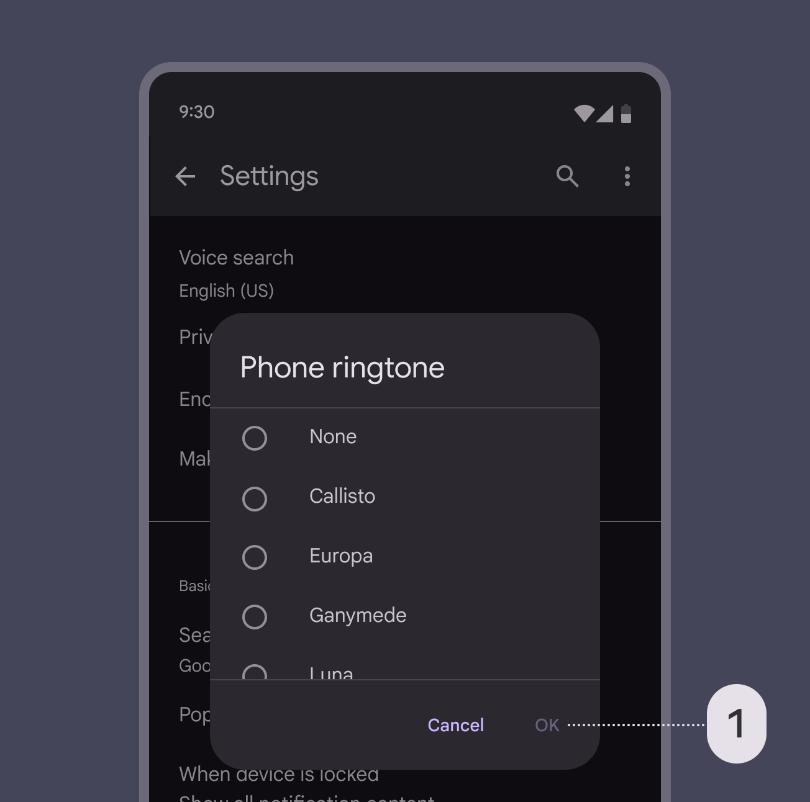
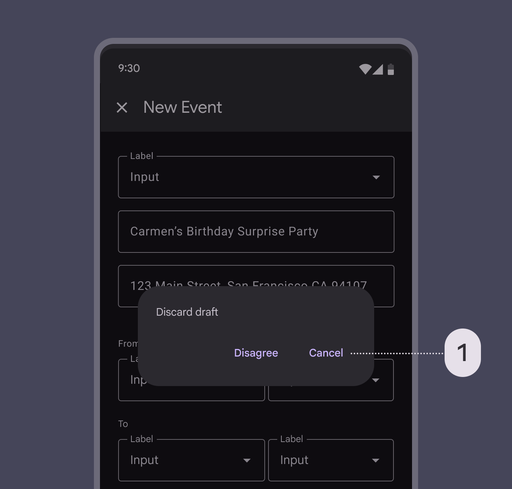
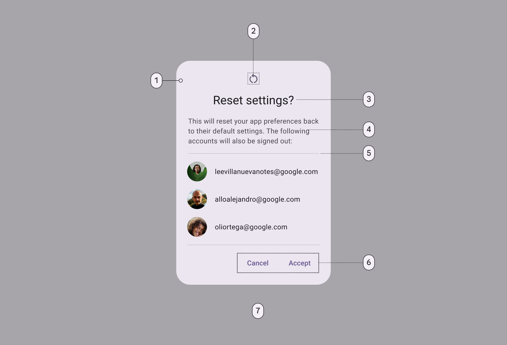
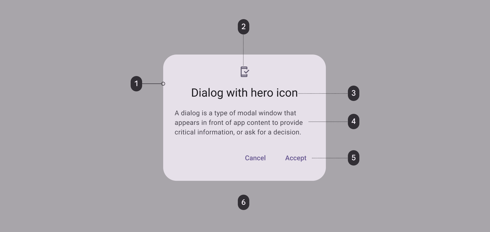
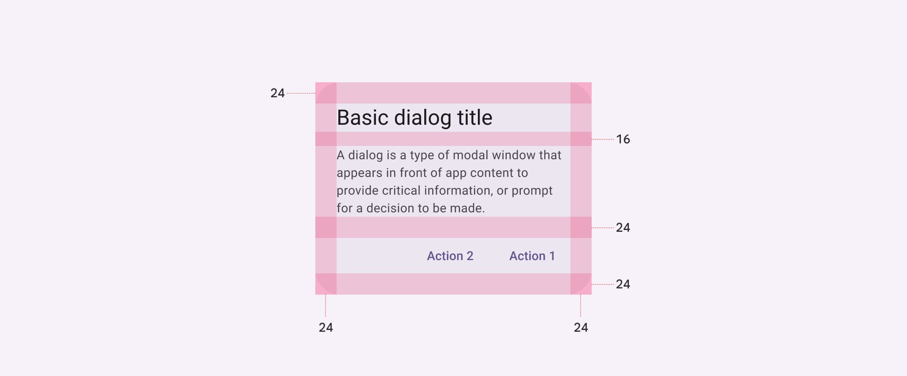

# Basic Dialogs - Material Design 3 Specification

## Guidelines

### Headline

A dialog’s purpose should be communicated by its headline and buttons or actionable items.

Headlines should:

- Contain a brief, clear statement or question
- Avoid apologies (“Sorry for the interruption”), alarm (“Warning!”), or ambiguity (“Are you sure?”)

Headlines should always be succinct. They can wrap to a second line if necessary, and be truncated.

### Buttons (label text)

Dialog actions are most often represented as buttons and allow users to confirm, dismiss, or acknowledge something.

Buttons are aligned to the trailing edge of the dialog for easier interaction. The confirmation button is always closest to the edge.

Button alignment responds automatically for right-to-left languages, where the confirmation button is aligned to the left edge.

A single action may be provided only if it’s an acknowledgement.
Avoid presenting users with unclear choices. “Cancel” doesn't make sense here because no clear action is proposed.

Dialogs should contain a maximum of two actions.

- If a single action is provided, it must be an acknowledgement action
- If two actions are provided, one must be a confirming action, and the other a dismissing action

### Usage

A dialog is a modal window that appears in front of app content to provide critical information or ask for a decision. Dialogs disable all app functionality when they appear, and remain on screen until confirmed, dismissed, or a required action has been taken.

Dialogs are purposefully interruptive, so they should be used sparingly. A less disruptive alternative is to use a dropdown menu, which provides options without interrupting a user’s experience.

#### Do

Use dialogs for prompts that block an app’s normal operation, and for critical information that requires a specific user task, decision, or acknowledgement

#### Don't

Don’t use dialogs for low- or medium-priority information. Instead use a snackbar, which can be dismissed or disappear automatically.

### Behavior

Dialogs use an enter and exit transition pattern to appear on screen.
The dialog's scrim only fades in and out.

### Position

Dialogs retain focus until dismissed or an action has been taken, such as choosing a setting. They shouldn’t be obscured by other elements or appear partially on screen, with the exception of full-screen dialogs.

### Scrolling

Most dialog content should avoid scrolling. Even when scrolling is required, the dialog title is pinned at the top, with buttons pinned at the bottom. This ensures selected content remains visible alongside the title and buttons, even upon scroll.

Dialogs don’t scroll with elements outside of the dialog, such as the background.

## Anatomy

1. Container
2. Icon (optional) - out of scope for our component!
3. Headline
4. Supporting text - a.k.a. our content
5. Divider (optional) - out of scope for our component@
6. Button (label text)
7. Scrim

### Container and scrim

Dialog containers appear above other screen elements and hold the dialog’s headline, text, buttons, and list items.

To focus attention on the dialog, surfaces behind the container are scrimmed with a temporary overlay to make them less prominent.

The dialog's scrim only fades in and out.

## Basic Dialog Specifications

### Enabled

#### Container

- **Dialog container color**: `md-sys-color-surface-container-high`
- **Dialog container elevation**: `md-sys-elevation-level3`
- **Dialog container surface tint layer color**: `md-sys-color-surface-tint`
- **Dialog container shape**: `--radius-3xl`

#### Label text

- **Dialog action label text font**: `md-sys-typescale-label-large-font`
- **Dialog action label text line height**: `md-sys-typescale-label-large-line-height`
- **Dialog action label text size**: `md-sys-typescale-label-large-size`
- **Dialog action label text weight**: `md-sys-typescale-label-large-weight`
- **Dialog action label text tracking**: `md-sys-typescale-label-large-tracking`
- **Dialog action label text color**: `md-sys-color-primary`

#### Headline

- **Dialog headline font**: `md-sys-typescale-headline-small-font`
- **Dialog headline line height**: `md-sys-typescale-headline-small-line-height`
- **Dialog headline size**: `md-sys-typescale-headline-small-size`
- **Dialog headline weight**: `md-sys-typescale-headline-small-weight`
- **Dialog headline tracking**: `md-sys-typescale-headline-small-tracking`
- **Dialog headline color**: `md-sys-color-on-surface`

#### Divider

- **Dialog divider color**: `md-sys-color-outline`
- **Dialog divider height**: `1dp`

#### Supporting text

- **Dialog supporting text font**: `md-sys-typescale-body-medium-font`
- **Dialog supporting text line height**: `md-sys-typescale-body-medium-line-height`
- **Dialog supporting text size**: `md-sys-typescale-body-medium-size`
- **Dialog supporting text weight**: `md-sys-typescale-body-medium-weight`
- **Dialog supporting text tracking**: `md-sys-typescale-body-medium-tracking`
- **Dialog supporting text color**: `md-sys-color-on-surface-variant`

### Hovered

#### Label text

- **Dialog action hover label text color**: `md-sys-color-primary`

#### State layer

- **Dialog action hover state layer color**: `md-sys-color-primary`
- **Dialog action hover state layer opacity**: `md-sys-state-hover-state-layer-opacity`

### Focused

#### Label text

- **Dialog action focus label text color**: `md-sys-color-primary`

#### State layer

- **Dialog action focus state layer color**: `md-sys-color-primary`
- **Dialog action focus state layer opacity**: `md-sys-state-focus-state-layer-opacity`

### Pressed (ripple)

#### Label text

- **Dialog action pressed label text color**: `md-sys-color-primary`

#### State layer

- **Dialog action pressed state layer color**: `md-sys-color-primary`
- **Dialog action pressed state layer opacity**: `md-sys-state-pressed-state-layer-opacity`

## Basic Dialog Color

Color values are implemented through design tokens. For design, this means working with color values that correspond with tokens. For implementation, a color value will be a token that references a value.

**Basic dialog color roles used for light and dark schemes:**

- Surface container high
- Secondary
- On surface
- On surface variant
- Primary
- Scrim

## Basic Dialog Measurements

| Attribute                        | Value                |
| -------------------------------- | -------------------- |
| Container shape                  | 28dp corner radius   |
| Container height                 | Dynamic              |
| Container width                  | Min 280dp; Max 560dp |
| Divider height                   | 1dp                  |
| Icon size                        | 24dp                 |
| Minimum width                    | 280dp                |
| Maximum width                    | 560dp                |
| Alignment with icon              | Center-aligned       |
| Alignment without icon           | Start-aligned        |
| Top/Left/right/bottom padding    | 24dp                 |
| Padding between buttons          | 8dp                  |
| Padding between title and body   | 16dp                 |
| Padding between icon and title   | 16dp                 |
| Padding between body and actions | 24dp                 |
