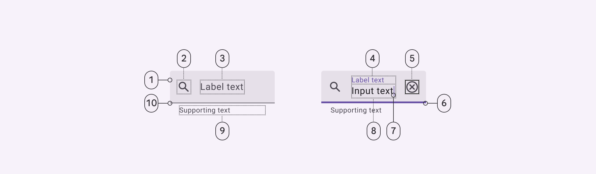
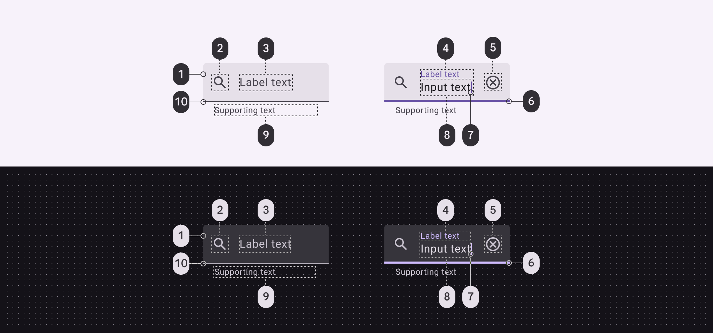
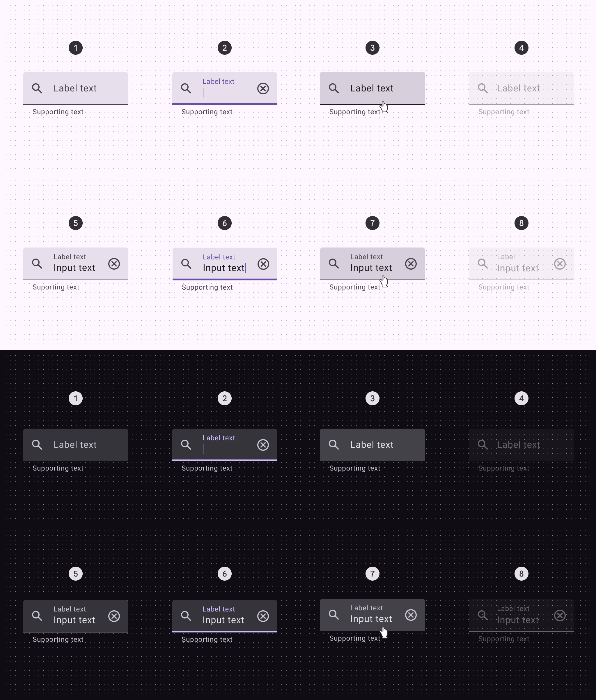
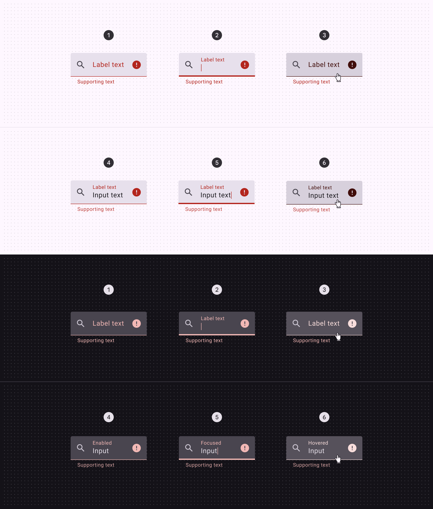
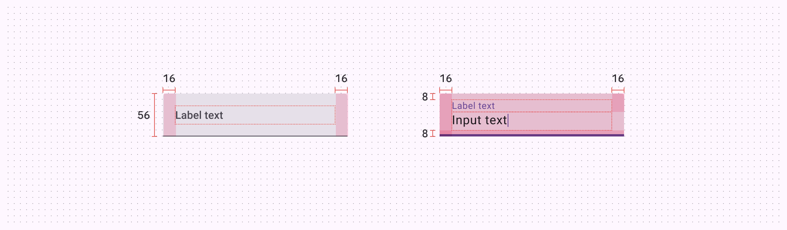
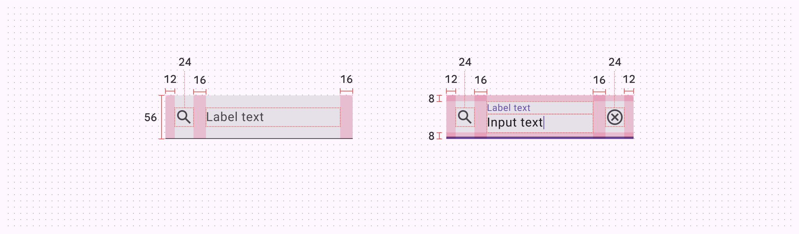
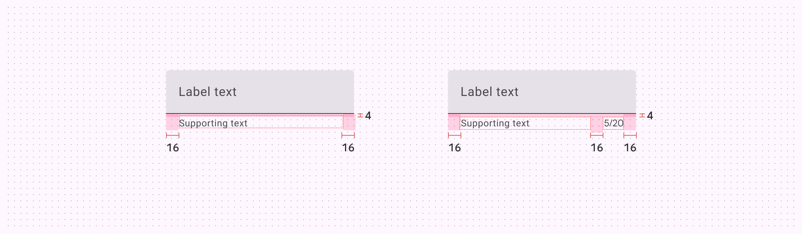
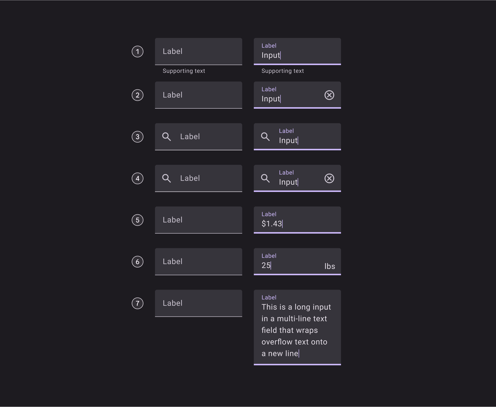

# Filled Text Field - Material Design 3 Specification

## Overview

Text fields let users enter text into a UI. A filled text field is a filled variant that provides clear affordance for interaction.

## Component Elements

1. Container
2. Leading icon (optional)
3. Label text (empty)
4. Label text (populated)
5. Trailing icon (optional)
6. Active Indicator (focused)
7. Caret
8. Input text
9. Supporting text (optional)
10. Active Indicator (enabled)

## Filled Text Field Specifications

### Enabled State

#### Container

- **Color**: `--md-sys-color-surface-container-highest`
- **Height**: 56dp
- **Shape**: md.sys.shape.corner.extra-small.top

#### Label Text

- **Color**: `--md-sys-color-on-surface-variant`
- **Font**: md.sys.typescale.body-large.font
- **Line height**: md.sys.typescale.body-large.line-height
- **Size**: md.sys.typescale.body-large.size
- **Weight**: md.sys.typescale.body-large.weight
- **Tracking**: md.sys.typescale.body-large.tracking
- **Type**: md.sys.typescale.body-large
- **Populated line height**: md.sys.typescale.body-small.line-height
- **Populated size**: md.sys.typescale.body-small.size

#### Leading Icon

- **Color**: `--md-sys-color-on-surface-variant`
- **Size**: 24dp

#### Trailing Icon

- **Color**: `--md-sys-color-on-surface-variant`
- **Size**: 24dp

#### Active Indicator

- **Height**: 1dp
- **Color**: `--md-sys-color-on-surface-variant`

#### Supporting Text

- **Color**: `--md-sys-color-on-surface-variant`
- **Font**: md.sys.typescale.body-small.font
- **Line height**: md.sys.typescale.body-small.line-height
- **Size**: md.sys.typescale.body-small.size
- **Weight**: md.sys.typescale.body-small.weight
- **Tracking**: md.sys.typescale.body-small.tracking

#### Input Text

- **Color**: `--md-sys-color-on-surface`
- **Font**: md.sys.typescale.body-large.font
- **Line height**: md.sys.typescale.body-large.line-height
- **Size**: md.sys.typescale.body-large.size
- **Weight**: md.sys.typescale.body-large.weight
- **Tracking**: md.sys.typescale.body-large.tracking
- **Type**: md.sys.typescale.body-large
- **Prefix color**: `--md-sys-color-on-surface-variant`
- **Suffix color**: `--md-sys-color-on-surface-variant`

#### Caret

- **Color**: `--md-sys-color-primary`

### Disabled State

#### Container

- **Color**: `--md-sys-color-on-surface`
- **Opacity**: 0.04

#### Label Text

- **Color**: `--md-sys-color-on-surface`
- **Opacity**: 0.38

#### Leading Icon

- **Color**: `--md-sys-color-on-surface`
- **Opacity**: 0.38

#### Trailing Icon

- **Color**: `--md-sys-color-on-surface`
- **Opacity**: 0.38

#### Supporting Text

- **Color**: `--md-sys-color-on-surface`
- **Opacity**: 0.38

#### Input Text

- **Color**: `--md-sys-color-on-surface`
- **Opacity**: 0.38

#### Active Indicator

- **Height**: 1dp
- **Color**: `--md-sys-color-on-surface`
- **Opacity**: 0.38

### Hovered State

#### State Layer

- **Color**: `--md-sys-color-on-surface`
- **Opacity**: md.sys.state.hover.state-layer-opacity

#### Supporting Text

- **Color**: `--md-sys-color-on-surface-variant`

### Focused State

#### Active Indicator

- **Color**: `--md-sys-color-primary`
- **Height**: 3dp

#### State Layer

- **Color**: `--md-sys-color-on-surface`
- **Opacity**: md.sys.state.focus.state-layer-opacity

### Error State

#### Active Indicator

- **Color**: `--md-sys-color-error`
- **Height**: 2dp

#### Supporting Text

- **Color**: `--md-sys-color-error`

#### Label Text

- **Color**: `--md-sys-color-error`

#### Input Text

- **Color**: `--md-sys-color-on-surface`

#### Trailing Icon

- **Color**: `--md-sys-color-error`

## Filled Text Field Color

Color roles used for light and dark schemes:

1. Surface container highest
2. On surface variant
3. On surface variant
4. Primary
5. On surface variant
6. Primary
7. Primary
8. On surface
9. On surface variant
10. On surface variant

## Filled Text Field States

States are visual representations used to communicate the status of a component or interactive element.

### Standard States

- Enabled (empty)
- Focused (empty)
- Hovered (empty)
- Disabled (empty)
- Enabled (populated)
- Focused (populated)
- Hovered (populated)
- Disabled (populated)

### Error States

- Enabled (empty)
- Focused (empty)
- Hovered (empty)
- Enabled (populated)
- Focused (populated)
- Hovered (populated)

## Filled Text Field Measurements

| Element         | Attribute                                             | Value               |
| --------------- | ----------------------------------------------------- | ------------------- |
| Container       | Default height                                        | 56dp                |
|                 | Label alignment (unpopulated)                         | Vertically centered |
|                 | Top/bottom padding                                    | 8dp                 |
|                 | Left/right padding without icons                      | 16dp                |
|                 | Left/right padding with icons                         | 12dp                |
|                 | Target size                                           | 56dp                |
| Icon            | Alignment                                             | Vertically centered |
|                 | Padding between icons and text                        | 16dp                |
| Supporting text | Top padding                                           | 4dp                 |
|                 | Padding between supporting text and character counter | 16dp                |

## Filled Text Field Configurations

The filled text field supports the following configurations:

1. With supporting text
2. With trailing icon
3. With leading icon
4. With leading and trailing icon
5. With prefix
6. With suffix
7. Multi-line text field
