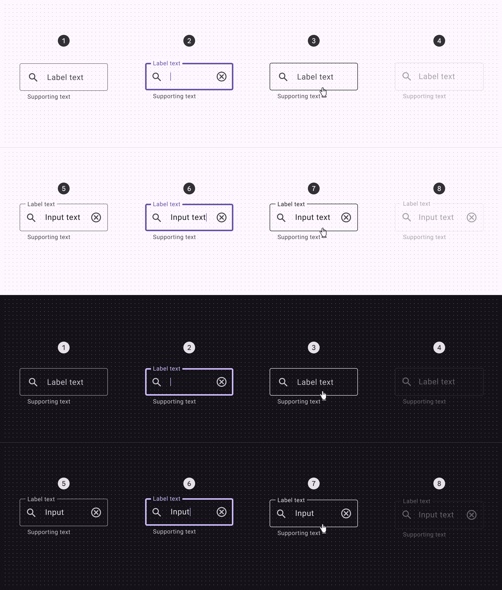
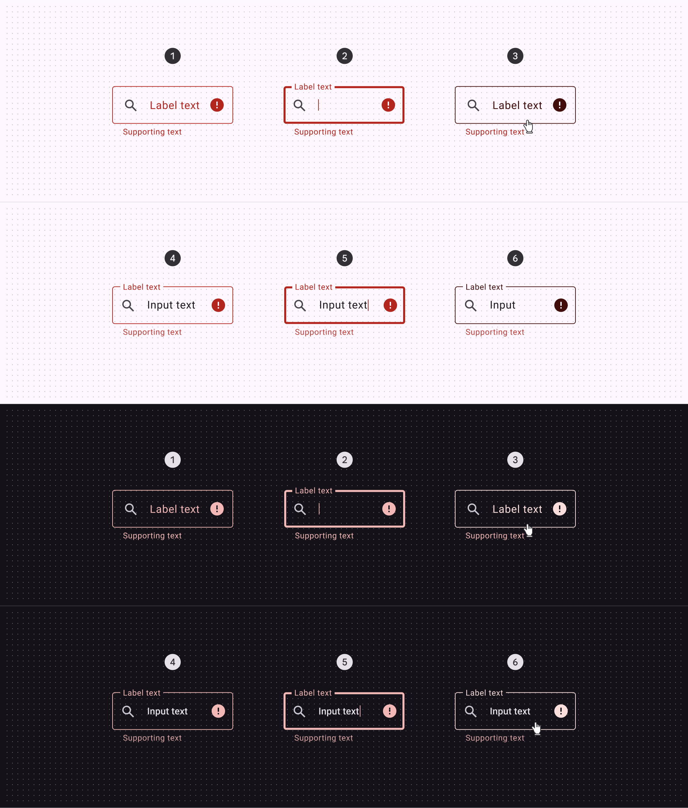
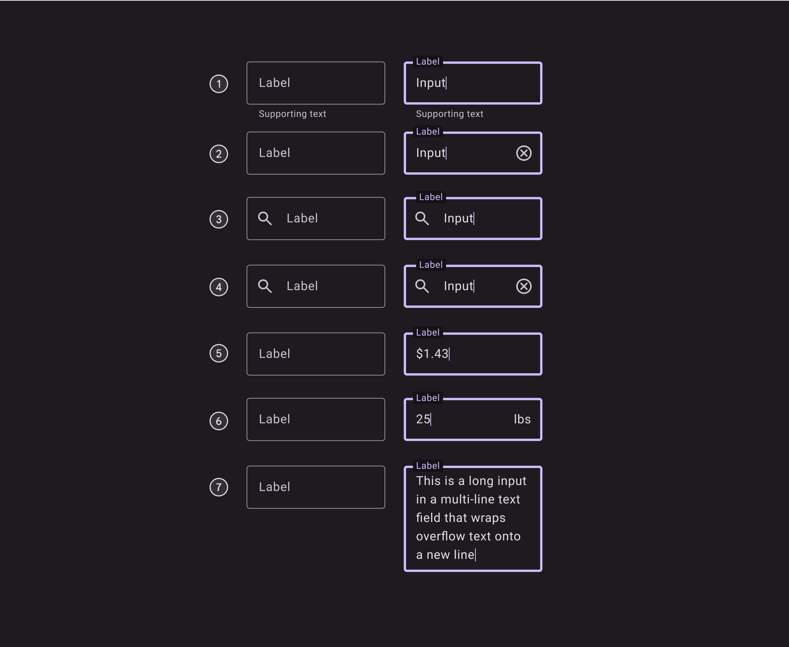

# Outlined Text Field - Material Design 3 Specification

## Overview

Text fields let users enter text into a UI. An outlined text field has a stroked border that provides clear visual separation and affordance for interaction.

## Component Elements

1. Container outline (enabled)
2. Leading icon (optional)
3. Label text (unpopulated)
4. Label text (populated)
5. Trailing icon (optional)
6. Container outline (focused)
7. Caret
8. Input text
9. Supporting text (optional)

## Outlined Text Field Specifications

### Enabled State

#### Container

- **Height**: 56dp
- **Shape**: md.sys.shape.corner.extra-small

#### Outline

- **Width**: 1dp
- **Color**: `--md-sys-color-outline`

#### Label Text

- **Color**: `--md-sys-color-on-surface-variant`
- **Font**: md.sys.typescale.body-large.font
- **Line height**: md.sys.typescale.body-large.line-height
- **Size**: md.sys.typescale.body-large.size
- **Weight**: md.sys.typescale.body-large.weight
- **Tracking**: md.sys.typescale.body-large.tracking
- **Type**: md.sys.typescale.body-large
- **Populated line height**: md.sys.typescale.body-small.line-height
- **Populated size**: md.sys.typescale.body-small.size

#### Leading Icon

- **Color**: `--md-sys-color-on-surface-variant`
- **Size**: 24dp

#### Trailing Icon

- **Color**: `--md-sys-color-on-surface-variant`
- **Size**: 24dp

#### Supporting Text

- **Color**: `--md-sys-color-on-surface-variant`
- **Font**: md.sys.typescale.body-small.font
- **Line height**: md.sys.typescale.body-small.line-height
- **Size**: md.sys.typescale.body-small.size
- **Weight**: md.sys.typescale.body-small.weight
- **Tracking**: md.sys.typescale.body-small.tracking

#### Input Text

- **Color**: `--md-sys-color-on-surface`
- **Font**: md.sys.typescale.body-large.font
- **Line height**: md.sys.typescale.body-large.line-height
- **Size**: md.sys.typescale.body-large.size
- **Weight**: md.sys.typescale.body-large.weight
- **Tracking**: md.sys.typescale.body-large.tracking
- **Type**: md.sys.typescale.body-large
- **Prefix color**: `--md-sys-color-on-surface-variant`
- **Suffix color**: `--md-sys-color-on-surface-variant`
- **Placeholder color**: `--md-sys-color-on-surface-variant`

#### Caret

- **Color**: `--md-sys-color-primary`

### Disabled State

#### Outline

- **Color**: `--md-sys-color-on-surface`
- **Opacity**: 0.12

#### Label Text

- **Color**: `--md-sys-color-on-surface`
- **Opacity**: 0.38

#### Leading Icon

- **Color**: `--md-sys-color-on-surface`
- **Opacity**: 0.38

#### Trailing Icon

- **Color**: `--md-sys-color-on-surface`
- **Opacity**: 0.38

#### Supporting Text

- **Color**: `--md-sys-color-on-surface`
- **Opacity**: 0.38

#### Input Text

- **Color**: `--md-sys-color-on-surface`
- **Opacity**: 0.38

### Hovered State

#### Outline

- **Color**: `--md-sys-color-on-surface`

#### State Layer

- **Color**: `--md-sys-color-on-surface`
- **Opacity**: md.sys.state.hover.state-layer-opacity

### Focused State

#### Outline

- **Color**: `--md-sys-color-primary`
- **Width**: 3dp

#### State Layer

- **Color**: `--md-sys-color-on-surface`
- **Opacity**: md.sys.state.focus.state-layer-opacity

### Error State

#### Outline

- **Color**: `--md-sys-color-error`
- **Width**: 2dp

#### Label Text

- **Color**: `--md-sys-color-error`

#### Supporting Text

- **Color**: `--md-sys-color-error`

#### Trailing Icon

- **Color**: `--md-sys-color-error`

#### Input Text

- **Color**: `--md-sys-color-on-surface`

## Outlined Text Field States

States are visual representations used to communicate the status of a component or interactive element.

### Standard States

- Enabled (empty)
- Focused (empty)
- Hovered (empty)
- Disabled (empty)
- Enabled (populated)
- Focused (populated)
- Hovered (populated)
- Disabled (populated)

### Error States

- Enabled (empty)
- Focused (empty)
- Hovered (empty)
- Enabled (populated)
- Focused (populated)
- Hovered (populated)

## Outlined Text Field Measurements

| Element         | Attribute                                             | Value               |
| --------------- | ----------------------------------------------------- | ------------------- |
| Container       | Height                                                | 56dp                |
|                 | Left/right padding without icons                      | 16dp                |
|                 | Left/right padding with icons                         | 12dp                |
|                 | Padding between icons and text                        | 16dp                |
|                 | Target size                                           | 56dp                |
| Icon            | Alignment                                             | Vertically centered |
| Supporting text | Top padding                                           | 4dp                 |
|                 | Padding between supporting text and character counter | 16dp                |
| Label           | Alignment                                             | Vertically centered |
|                 | Left/right padding populated label text               | 4dp                 |

## Outlined Text Field Configurations

The outlined text field supports the following configurations:

1. With supporting text
2. With trailing icon
3. With leading icon
4. With leading and trailing icon
5. With prefix
6. With suffix
7. Multi-line text field

